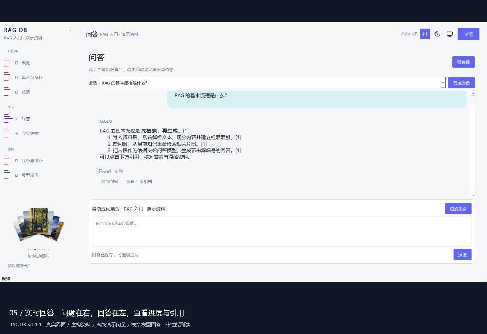

# RAGDB · 个人学习知识库

把散落的笔记、论文、课件、网页和代码整理成可检索、可追溯、可持续学习的知识集合。

RAGDB 是一个使用 **Python + PySide6** 构建的桌面 RAG（检索增强生成）系统，同时提供命令行工具。你可以先导入自己的资料，再检索原文、围绕资料提问，或生成摘要、提纲、练习题和知识卡片。知识库保存在本机，嵌入模型与问答模型可分别配置为本地或云端服务。

**当前版本：v0.1.1 · Windows x64 · 项目状态更新：2026-09-29**

[下载安装包](https://github.com/Qorq-byte/RAG_db_test/releases/download/v0.1.1/RAGDB-0.1.1-windows-x64-setup.exe) · [发布说明与校验文件](https://github.com/Qorq-byte/RAG_db_test/releases/tag/v0.1.1) · [进阶使用指南](docs/user-guide.md) · [项目进度](task_plan.md)

## 项目演示

[](docs/media/ragdb-tour.mp4)

**[观看 / 下载 60 秒演示视频（MP4）](docs/media/ragdb-tour.mp4)**。如果 GitHub 页面未显示播放器，点击视频文件页的 **View raw / Download raw file** 下载后播放。

| 时间 | 演示内容 |
| --- | --- |
| 00:00–00:14 | 欢迎页加载动画、滚动探索、点击进入工作台 |
| 00:14–00:25 | 建立演示集合、导入文本、自动建立索引 |
| 00:25–00:33 | 检索相关片段、查看原文证据 |
| 00:33–00:47 | 确认当前集合、发送问题、观看流式回答与引用 |
| 00:47–01:00 | 查看最近任务和操作日志，返回概览 |

视频录制的是项目真实 Qt 界面；资料为专门编写的演示文本，向量使用离线演示实现，模型回答为预设流式输出。它用于展示操作流程，**不代表真实大模型的回答质量或响应速度**。录制不读取个人知识库、用户配置或 API Key，也不捕获桌面其他窗口。详见[演示素材说明](docs/media/README.md)。

## 项目能做什么

| 能力 | 说明 |
| --- | --- |
| 分集合管理资料 | 按课程、主题或项目建立知识空间，查看和删除资料 |
| 多来源导入 | 本地文件、目录、手工文本、网页、公开 GitHub 仓库；CLI 支持目录监听 |
| 常见文档解析 | TXT、Markdown、PDF、DOCX、PPTX 和支持的代码文件；扫描 PDF 可选本机 Tesseract OCR |
| 混合检索 | 向量检索与 SQLite 全文关键词检索融合排序，可选重排序模型 |
| 可追溯问答 | 显示当前提问集合、生成阶段、流式输出、引用详情，支持停止与重试 |
| 会话管理 | 历史会话持久化，支持勾选删除；切换集合时保留当前对话 |
| 学习产物 | 基于检索资料生成摘要、提纲、学习笔记、练习题、知识卡片 |
| 模型管理 | 问答与嵌入独立设置，连接测试、系统凭据保存、全库重建并切换 |
| 任务与维护 | 导入记录、操作日志、环境诊断、旧索引预览清理、全库备份恢复 |
| 桌面与 CLI | 原生欢迎动画、可折叠导航、深浅主题；同一套核心服务支持命令行 |

适合个人课程复习、论文阅读、技术笔记整理、项目文档查询。当前定位为个人桌面知识库；不要把它当作已具备多人权限、团队协作和公网托管能力的平台。

## RAG 如何工作

```text
资料 → 解析与切片 → 嵌入向量 + 关键词索引 → 保存到本地知识库
                                         ↑
问题 → 当前集合内检索 → 相关资料片段 → 问答模型 → 回答 + 来源引用
```

- **集合**：一次提问所检索的资料范围。不同集合用于隔离主题。
- **嵌入模型**：把资料和问题转换成向量，用于寻找语义相关内容；通常不负责生成回答。
- **问答模型**：阅读检索片段并生成答案，也用于学习内容生成。
- **引用**：回答对应的证据快照，可回看来源和正文。引用有助于核验，但不保证模型不会出错。

导入成功后会自动完成解析、切片和向量化，无需再手动执行一次“向量化”。前提是嵌入模型配置可用。没有足够检索证据时，程序返回无法依据知识库回答的提示，不继续调用问答模型。

## 安装与升级

### Windows 安装版（普通用户）

1. 从 [v0.1.1 发布页](https://github.com/Qorq-byte/RAG_db_test/releases/tag/v0.1.1)下载 `RAGDB-0.1.1-windows-x64-setup.exe`。
2. 关闭正在运行的旧版 RAGDB，运行安装程序。升级时沿用原安装目录，无需先卸载；重要资料建议先备份。
3. 从开始菜单打开 **RAGDB**。安装包包含 Python 运行环境，但不包含模型权重、Ollama、Tesseract 或 API Key。

默认程序目录为 `%LOCALAPPDATA%/Programs/RAGDB`，默认配置与知识库目录为 `%LOCALAPPDATA%/RAGDB`。卸载保留资料目录。安装目录内的 `RAGDB-CLI.exe` 可用于执行下文命令行功能。

校验下载文件：

```powershell
Get-FileHash .\RAGDB-0.1.1-windows-x64-setup.exe -Algorithm SHA256
```

将结果与同一发布页的 `SHA256SUMS.txt` 比对。安装包目前未做代码签名；安装、启动和校验记录见[安装包验收](docs/acceptance/2026-09-27-windows-installer-v0.1.1.md)。

### 从源码运行（开发者）

需要 **Python 3.11**（暂不支持 3.12+）、[uv](https://docs.astral.sh/uv/) 和 Git。

```powershell
git clone https://github.com/Qorq-byte/RAG_db_test.git
cd RAG_db_test
uv sync --frozen
uv run ragdb-gui
```

源码运行默认读取项目目录的 `config.toml`；配置结构见 `config.example.toml`。请按自己的环境设置模型，不要直接依赖开发机器上的服务。需要打开另一份配置时：

```powershell
uv run ragdb-gui --config C:/RAGDB-demo/config.toml
uv run ragdb --config C:/RAGDB-demo/config.toml doctor
```

## 邮箱账号与首次配置（当前源码）

当前源码新增了注册、邮箱确认和登录门禁：桌面工作台及知识库命令必须使用已验证账号，两个账号在同一电脑上也分别使用自己的数据目录。**v0.1.1 安装包尚不包含此功能**；需待认证服务实际配置、邮件与安装版验收完成后再更新安装包。没有配置认证项目时，当前源码会停留在登录页，CLI 知识库命令会拒绝访问。

项目使用 [Supabase Auth 邮箱密码认证](https://supabase.com/docs/guides/auth/passwords)。Supabase 项目已创建，本机已验证 Project URL 与 publishable key 能连接认证设置接口，且邮箱注册与邮箱确认已启用。管理员已在控制台保存自定义 SMTP；**任意用户的实际邮件投递及完整注册登录流程仍待验收**。Supabase 默认发信服务只允许组织成员邮箱，不能用于开放注册。把项目的 **Project URL** 和 **publishable key**（或旧版 anon key）填入本机 `config.toml` 的 `[auth]`；也可通过本机 `.env` 中的 `RAGDB_AUTH__URL` 与 `RAGDB_AUTH__PUBLISHABLE_KEY` 设置。**service_role / secret Key 和 SMTP 凭据绝不能放进客户端、配置样例或仓库**。

管理员需在 Supabase **Authentication → Email Templates → Confirm sign up** 中将确认邮件改为显示验证码，例如：

```html
<h2>RAG DB 邮箱验证码</h2>
<p>你的注册验证码是：<strong>{{ .Token }}</strong></p>
<p>请在 RAG DB 中输入此验证码；不要转发给他人。</p>
```

代码验证使用 Supabase 官方的 [邮件 OTP 流程](https://supabase.com/docs/guides/auth/auth-email-templates)；验证码发送、验证和登录仍需联网。邮件投递由[自定义 SMTP](https://supabase.com/docs/guides/auth/auth-smtp)承担。

```toml
[auth]
url = "https://YOUR-PROJECT.supabase.co"
publishable_key = "sb_publishable_..."
```

桌面端启动后先输入邮箱、密码和确认密码，点击“注册并发送验证码”；把邮件中的数字验证码完整填入“验证码”并点击“验证邮箱”，然后用邮箱和密码登录。验证码长度由 Supabase 项目设置决定，当前项目发送 8 位数字。验证码过期或未收到时点击“重发验证码”。已有账号输入邮箱和密码直接登录。状态栏提供“退出登录”。CLI 依次执行 `ragdb auth register you@example.com`、`ragdb auth verify you@example.com`、`ragdb auth login you@example.com`；可用 `ragdb auth resend you@example.com` 重发，`ragdb auth status` 查看状态，`ragdb auth logout` 退出。密码和验证码通过终端隐蔽输入。密码不会保存在本机，刷新令牌存于系统凭据库；启动和 CLI 每次执行知识库命令都会在线验证。网络或认证服务不可用时，会拒绝打开知识库。

登录后的数据保存在 `<storage.data_dir>/accounts/<账号 UUID>/`。原有 `<storage.data_dir>` 下的旧库保持原状，**不会自动迁移或合并到任一新账号**。如需迁移旧资料，先备份旧库，确认所属账号后再由管理员安排导入；更换账号也不会自动共享本机知识库。登录保护并不加密磁盘文件，本机操作系统用户仍须妥善保护数据目录。

## 桌面使用教程

### 1. 从欢迎页进入工作台

完成邮箱登录后播放图片卡片聚合动画。向下滚动，图片从圆环变为弧带并依次移出；继续滚动出现 **“欢迎使用RAG系统”**，点击进入导航工作台。

也可按 `End` 或 `Esc` 直接到入口，再按 `Enter` 进入。启用“减少动效”后直接显示最终状态。欢迎页图片为离线资源；点击进入前不会初始化知识库或调用模型。

### 2. 配置嵌入模型和问答模型

打开侧栏 **系统 → 模型设置**。先配置嵌入，再配置问答，两者不必使用同一家服务商。

| 用途 | 可选方式 | 需要填写 / 准备 |
| --- | --- | --- |
| 嵌入 | 本地 Sentence Transformers | 嵌入模型名称；首次加载可能下载权重 |
| 嵌入 | 本地 Ollama | 已安装的嵌入模型名、Ollama 服务地址 |
| 嵌入 | 云端 / OpenAI 兼容 | 支持 `/embeddings` 的模型、Base URL、API Key |
| 问答 / 生成 | 本地 Ollama | 已安装的聊天模型名、服务地址 |
| 问答 / 生成 | 云端 / OpenAI 兼容 | 聊天模型名、Base URL、API Key |

**本地嵌入示例**：先安装并启动 Ollama，然后在终端执行：

```powershell
ollama pull embeddinggemma
ollama list
```

在嵌入设置选择“本地 Ollama”，服务地址填写 `http://127.0.0.1:11434`，模型填写列表中的 `embeddinggemma:latest`。点击“测试连接”，成功后执行“重建并切换”。问答另选一个已安装的聊天模型；嵌入模型不能直接代替聊天模型。

**云端配置**：按服务商控制台填写地址、模型和密钥。问答选聊天模型；嵌入必须选提供兼容 `/embeddings` 接口的嵌入模型。聊天接口能连通不代表该服务支持嵌入。嵌入地址支持基础地址或完整 `/embeddings` 地址。

- 问答：**测试连接 → 保存并应用**。
- 嵌入更换模型或地址：**测试连接 → 重建并切换**。已有资料会使用新模型重建全部集合；验证成功才启用，失败或取消保留原活动索引。
- 活动云端嵌入仅更换密钥：点击 **保存密钥**，验证后保存，无需重建。
- 密钥框留空表示沿用该目标已保存的密钥。更换服务地址时重新提供密钥。

API Key 由系统凭据库保存，不写入 TOML。环境变量或 `.env` 接管的字段会在页面标明并锁定；修改外部值后需要重启。具体规则见[模型设置与配置参考](docs/user-guide.md#模型设置)。

### 3. 建立集合并导入资料

进入 **集合与资料 → 新建集合**，例如命名为“RAG 入门”，选中该集合，再从“导入资料”选择文件、目录、文本、网页或 GitHub 仓库。

第一次体验可以导入下面这段公开演示文本：

```text
RAG 的基本流程是先检索，再生成。导入资料后，系统解析文本、切分内容并建立检索索引。
提问时，从当前知识集合检索相关片段，把片段作为依据交给问答模型，生成带来源编号的回答。
```

等待导入结束，资料清单应出现新记录。嵌入模型在此过程中自动向量化；如失败，到“任务与诊断”查看具体任务状态。PDF 若只有扫描图片，需要另装并启用 Tesseract OCR；并非所有扩展名都可解析。

### 4. 先检索，再提问

在 **检索** 输入“RAG 的基本流程”，点击“检索”。点击结果，在右侧详情查看原文、位置和来源，确认所需信息已入库。

进入 **问答**，核对输入框上方 **“当前提问集合：RAG 入门”**，输入“RAG 的基本流程是什么？”并发送。

- `Enter` 发送，`Shift+Enter` 换行。
- 问题靠右、回答靠左；用户蓝色气泡随文字变长向左扩展，超出最大宽度后向下换行，文字保持正常从左到右。检索、连接模型、生成阶段和耗时实时显示。
- 点击引用查看依据；支持 Markdown、代码块和复制。
- 点击“停止生成”请求停止；等待当前检索或网络操作返回后结束。失败可重试，服务不支持流式时可选择非流式重试。
- 完整成功的回答才保存为历史；中断的部分内容不会进入后续模型上下文。
- 上滚查看历史不会被强制拉回底部，可点击“回到最新回答”。

**切换集合只改变下一次问题的检索范围，不新建会话，也不清空草稿。** 点击“新会话”或主动选择历史会话才切换对话。失败重试使用当前显示的集合，发送前再次核对即可。

会话按最初创建时的集合归档。删除该归档集合会同时删除其会话；仅删除会话不会删除知识库资料。打开 **管理会话**，勾选一条或多条记录，点击“删除所选”并确认。生成期间暂时禁用集合切换与会话删除。

### 5. 生成学习产物

在 **学习产物** 选择类型、填写主题并生成。支持摘要、提纲、学习笔记、练习题和知识卡片。结果及引用快照会保存，便于继续复习；内容仍需依据来源核验。CLI 可通过 `--source-id` 限定单一资料。

### 6. 查看任务、统计和维护知识库

| 板块 | 如何使用 |
| --- | --- |
| 概览 | 查看当前集合的资料、归档会话、学习产物及最近任务；打开立即刷新，可见时每 2 秒更新 |
| 最近任务 | 先选择集合，查看导入开始 / 结束状态及新增、更新、跳过、失败数量；最多展示最近 20 条 |
| 操作日志 | 查看同一集合的导入和维护记录；可点“刷新记录”，旧版未写入的历史不会自动补齐 |
| 环境诊断 | 检查配置、目录权限和依赖等；诊断通过不等于云端模型连接测试通过 |
| 索引维护 | 先预览旧索引，再确认清理；活动索引受保护，无法验证安全性时拒绝清理 |
| 备份与恢复 | 创建全库 ZIP、校验或恢复到一个尚不存在的新目录；不会覆盖原库 |

备份包含已入库正文、索引、对话、学习产物、日志和不含密钥的配置，不包含库外原文件、模型缓存及系统凭据。换机器后重新配置模型和密钥。备份本身含资料正文，应自行妥善保管。

侧栏 RAG DB 旁的醒目数字表示知识集合总数，“学习产物”旁的数字表示当前集合产物数；切换集合、生成或删除产物后会更新，窗口可见时还会周期校准。尚未选择集合时不显示学习产物数。

侧栏可拖动调整宽度；`Ctrl+B` 折叠或展开，`Ctrl+1` 至 `Ctrl+6` 切换常用页面，`Esc` 关闭详情。顶部主题按钮可切换浅色、深色或跟随系统。

## 常用命令行

以下命令在源码目录运行。安装版可把 `uv run ragdb` 替换为安装目录内的 `RAGDB-CLI.exe`。

```powershell
# 创建集合和导入文本
uv run ragdb collection create ai-notes --description "AI 学习资料"
uv run ragdb ingest text "RAG 将检索结果作为生成依据。" --collection ai-notes --title "RAG 笔记"

# 检索、提问、生成摘要
uv run ragdb search "RAG" --collection ai-notes
uv run ragdb chat ask "RAG 如何使用检索结果？" --collection ai-notes
uv run ragdb generate summary "RAG" --collection ai-notes

# 任务、日志、诊断
uv run ragdb task list --collection ai-notes
uv run ragdb log list --collection ai-notes
uv run ragdb doctor

# 查看全部命令和参数
uv run ragdb --help
```

文件 / 目录导入、网页抓取、公开仓库导入、目录监听、元数据过滤、备份恢复和评估命令见[进阶使用指南](docs/user-guide.md)。

## 常见问题

| 现象 | 排查方法 |
| --- | --- |
| `127.0.0.1:11434/api/chat` 返回 404 | 检查 Ollama 服务及 `ollama list` 中的聊天模型名称；若使用云端服务，在问答设置改选云端并填写对应地址和模型 |
| 测试成功但保存失败 | 确认已升级 v0.1.1；检查配置目录写权限与系统凭据库状态，以及是否有环境变量接管字段 |
| 云端聊天成功，嵌入失败 | 确认该服务提供兼容嵌入接口，使用嵌入模型；检查模型权限、密钥、额度与地址 |
| 导入很慢 | 首次本地模型可能下载或加载；OCR、大资料库、云端限流也会影响速度，可查看任务进度 |
| 导入后无检索结果 | 核对当前集合、导入任务是否成功和嵌入配置，先用原文中的明确关键词搜索 |
| 回答不准确 | 先查检索结果及引用是否相关，再检查切片、模型和原始资料；模型输出需人工核对 |
| 最近任务 / 日志空白 | 先选集合并刷新；旧版未记录的历史不补写，v0.1.1 新执行的导入应有记录 |
| 修改 TOML 后嵌入模型没变 | 已有索引以数据库活动模型为准，需要在模型设置中“重建并切换” |
| 旧索引清理后磁盘没明显变小 | 向量条数不等于释放字节数，物理空间回收取决于 Chroma 存储机制 |

## 项目进度与计划

以下状态以 **v0.1.1** 和已提交验收记录为准；候选计划不代表已实现或已有发布日期。

| 模块 / 阶段 | 状态 | 已交付内容 |
| --- | --- | --- |
| 本地知识库核心 | 已完成 | 文档解析、切片、SQLite 元数据与关键词索引、Chroma 向量、混合检索 |
| RAG 与学习生成 | 已完成 | 引用、会话持久化、流式回答、学习产物 |
| 桌面工作台 | 已完成 | 欢迎动画、导航、主题、资料管理、任务与诊断 |
| 模型与索引管理 | 已完成 | 连接测试、凭据保存、全库重建、安全发布、旧索引清理 |
| 备份与评估 | 已完成 | 全库备份恢复、固定资料集评估与离线管线冒烟 |
| v0.1.1 体验修复 | 已发布 | 密钥保存、会话删除、集合切换保留会话、导入记录、概览刷新、嵌入接口兼容 |
| Windows 安装交付 | 已发布 | 独立安装、启动、自检、隔离覆盖安装 / 卸载及远端 SHA256 校验 |
| 侧栏数量显示 | 源码已完成 | RAG DB 旁显示集合总数，学习产物旁显示当前集合产物数；尚未更新安装包 |
| 更多服务商真实账号验证 | 后续候选 | 扩展模型兼容性记录；目前不能宣称所有云端模型都已实测 |
| 复杂文档离线评估 | 源码已完成 | 新增 Markdown、Word 表格、文本层 PDF 的 5 资料 / 8 查询隔离样本；真实资料优化仍需具体案例 |
| 索引底层可靠性 | 持续跟踪 | 保留已验证恢复机制，继续跟踪 Chroma 上游问题 |

2026-09-29 当前源码的完整回归 **481 项通过**，侧栏四位数补丁另有 1 项定向复验通过；v0.1.1 发布前的功能回归 **475 项通过**；版本与入口另有 **4 项检查通过**。冻结程序自检、安装与素材演示检查是不同验证范围，不把它们合并成同一次全量测试。云端嵌入通过隔离 HTTP 场景验证，本机 Ollama 有实测；未逐一使用其他服务商真实账号验证。

本次文档录制另外发现并修复了顶部问答状态控件引用问题，源码 `2bae7d7` 已提交，26 项桌面回归通过。自适应问答气泡、侧栏计数和复杂文档离线评估也已在后续源码完成；这些后续改动尚未重新打入 v0.1.1 安装包。演示使用包含顶部状态修正的源码。

- [完整进度与下一阶段](task_plan.md)
- [嵌入连接验收](docs/acceptance/2026-09-27-embedding-connectivity.md)
- [安装包验收与验证边界](docs/acceptance/2026-09-27-windows-installer-v0.1.1.md)
- [交付时间线](progress.md)

### 已知限制

- 更换嵌入模型需重建全部集合，期间暂停导入和删除；首次加载模型可能较慢。
- 停止请求不会强制中断正在执行的网络或检索操作。
- Chroma 特定微型索引读取错误有隔离进程恢复机制，但上游精确根因尚未证明解决。
- 资料解析、OCR 和回答质量取决于文档、模型及配置；固定小型评估集通过不代表所有知识库效果。
- Windows 安装版是当前已验证交付目标；源码可用性与其他系统的安装包支持应分别评估。

## 数据与隐私

**本地存储不等于所有模型调用都在本机。** 选择本地模型可减少资料外发；选择云端时，应先确认资料允许发送给所选服务。

| 操作 | 数据流向 |
| --- | --- |
| 注册 / 登录（后续源码） | 邮箱、密码及登录令牌发送给所配置的 Supabase Auth 项目；密码不写入本机配置，刷新令牌放在系统凭据库 |
| 本地解析与索引存储 | 本机 SQLite / Chroma 数据目录 |
| 云端嵌入 | 将待嵌入资料切片或检索问题发送到配置的服务；全库重建涉及所有集合当前切片 |
| 云端问答 / 学习生成 | 将问题或主题、检索证据等上下文发送到配置的聊天服务；问答还可能包含会话历史 |
| 连接测试 | 发送固定短文本，不替换知识库索引 |
| 网页 / 仓库导入 | 联网访问用户指定的网页或公开仓库 |

API Key 放在系统凭据库、环境变量或本机 `.env`，不写入公开文档或 TOML。`.env`、`.data/` 和构建产物已被 Git 忽略；忽略规则不能替代人工检查。提交前核查文件清单，不上传实际资料、备份 ZIP、聊天记录、含令牌的 URL、个人路径或诊断日志中的敏感内容。

本 README 的示例均为公开演示内容；视频只包含隔离演示库。报告问题时提供版本、操作步骤、已脱敏的错误信息即可，不要附 API Key 或完整个人知识库。

## 技术结构与开发

```text
src/ragdb/
  desktop/          PySide6 页面、组件、主题与后台任务
  application/      导入、检索、问答、生成、备份和索引维护流程
  domain/           数据模型、接口与领域错误
  infrastructure/   SQLite、Chroma、模型适配、文档解析和网络访问
  cli.py            命令行入口
  runtime.py        桌面与 CLI 共享的服务组装
scripts/            构建与演示录制脚本
packaging/          Windows 打包配置
tests/             单元与集成测试
docs/              使用指南、设计计划、验收及演示素材
```

运行测试或离线检索冒烟：

```powershell
uv run pytest
uv run ragdb evaluate run offline-report.json --offline
```

复杂文档离线评估可运行 `uv run ragdb --config config.example.toml evaluate run .data/complex-report.json --dataset src/ragdb/evaluation_data/complex_documents.json --offline`；结果与适用边界见[验收记录](docs/acceptance/2026-09-29-complex-documents.md)。

完整测试可能需要较长时间；模型下载、真实云端账号验证与离线测试不是同一件事。Windows 构建使用 PyInstaller 和 Inno Setup，见[构建方法](docs/user-guide.md#windows-安装版)。

欢迎提交可复现的问题和改进建议。修改代码前请阅读相关验收记录，测试时使用隔离资料库；提交只包含本次改动，避免把个人配置和数据一并加入仓库。
